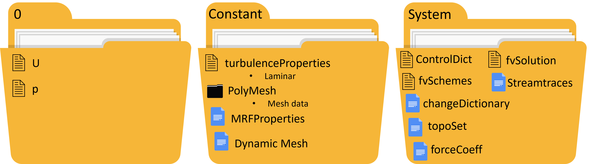
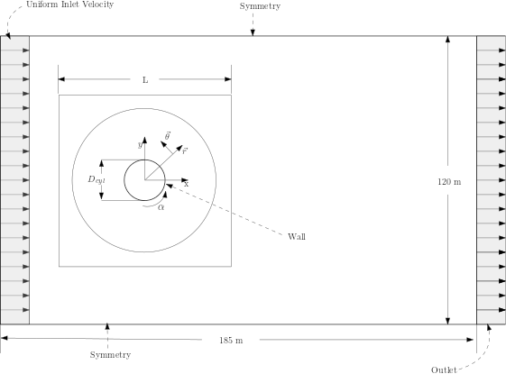

# Flow Around a Rotating Cylinder using OpenFOAM

## Introduction

This repository contains the setup files for numerical simulation project for studying the flow around a rotating cylinder using OpenFOAM. The two approaches that will be used to simulate the flow around the rotating cylinder are: 

- rotatingWallVelocity Function (Rotating Boundary Conditions {RBC})
- Multiple Reference Frame (MRF)

OpenFOAM is an open-source CFD (Computational Fluid Dynamics) software designed to model fluid flows and other continuum phenomena. The simulation is set up to capture the details of the flow patterns around a cylinder rotating at a constant angular velocity.

## Requirements

- OpenFOAM 

## Directory Structure



The files depicted with blue icons - imply functional files within OpenFOAM which are used to perform a particular task. For instance, the MRFProperties files is used to setup the axis, region and speed of rotating region.

## Geometry

<p align="center">
![An illustration of the geometry designed from the works of Mittal and Kumar (2003)[1]](Images/Geo_BC_WhiteBackground.png)

</p>
  
</p>


### Mesh Generation

- Meshing is done using Pointwise for the setup of this repository, but any meshing tool can be used since this is a 2D cylinder setup. 

### Boundary Conditions

- In the `0/` directory, boundary conditions for `U`, `p`, and other necessary fields are specified.
- Cylinder wall is set to rotate at a specified angular velocity.

### Solver Selection

- The simulation is set up to use `pimpleFoam` for incompressible, transient flow.

### Control Parameters

- Control parameters like time-step, write interval, and run-time are specified in `system/controlDict`.

## Running the Simulation

1. Source OpenFOAM environment variables:

    \```
    source /path/to/OpenFOAM/OpenFOAM-x.x/etc/bashrc
    \```

2. Navigate to the simulation root directory.

3. Generate the mesh:

    \```
    blockMesh
    \```

    (Optional: Refine mesh)

    \```
    snappyHexMesh -overwrite
    \```

4. Initialize the simulation:

    \```
    pimpleFoam
    \```

5. (Optional) Run the simulation using the shell script:

    \```
    chmod +x runSimulation.sh
    ./runSimulation.sh
    \```

## Post-Processing

- Open the simulation results in ParaView to visualize the flow fields, vortex shedding, etc.
- Optional post-processing scripts are located in the `postProcess/` directory.

## Contributing

Feel free to fork the project and submit pull requests. Ensure you adhere to the coding and documentation guidelines.

## Authors

- [Your Name](mailto:youremail@example.com)

## Acknowledgements

- OpenFOAM Foundation for the software.
- [Reference Paper](link)


### References
- [1] Mittal, S., & Kumar, B. (2003). *Flow past a rotating cylinder*. Journal of Fluid Mechanics, Volume(476), 303 - 334, url = https://api.semanticscholar.org/CorpusID:53349365.

## License

This project is licensed under the MIT License. See the LICENSE.md file for details.

---

For more details, feel free to contact the author or refer to the project documentation.


